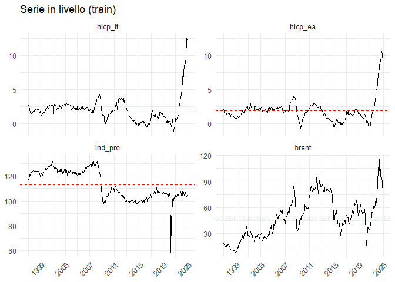
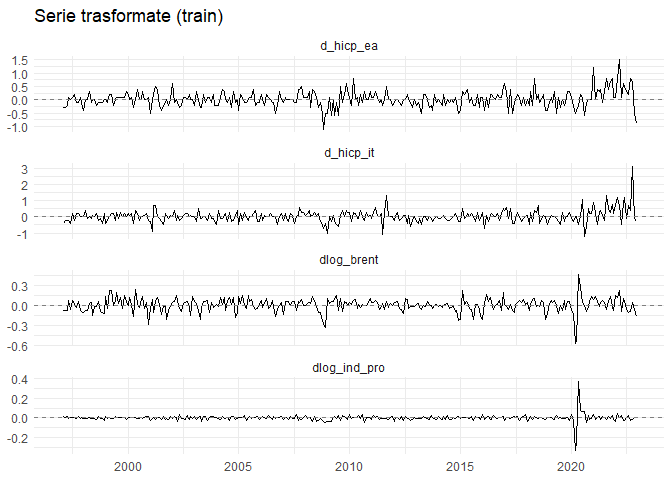

02 - Analisi di Stazionarietà
================

# Obiettivo del notebook

Ogni modello di questo progetto deve essere stimato su variabili
**stazionarie**: una regressione fra serie non stazionarie produce
relazioni spurie, cioè coefficienti apparentemente significativi che
riflettono solo trend comuni e non un legame reale. Questo notebook
stabilisce, per ciascuna delle quattro serie, se è stazionaria e quale
trasformazione serve per renderla tale.

Il percorso è in quattro passi:

1.  **Ispezione grafica**, per capire quale comportamento deterministico
    assumere nei test (media costante oppure trend).
2.  **Test formali ADF e KPSS** sui livelli, incrociati fra loro.
3.  **Test di Zivot-Andrews**, per distinguere una vera radice unitaria
    da una stazionarietà mascherata da un break strutturale.
4.  **Trasformazione in differenze e retest**, per verificare che le
    serie trasformate siano effettivamente stazionarie.

Le conclusioni di questo notebook determinano tutto ciò che segue:
l’ordine di integrazione stabilito qui decide quali variabili possono
entrare nel test di cointegrazione (notebook 03) e con quale
trasformazione compaiono nei modelli (notebook 04-05).

# Caricamento dati e separazione train/test

``` r
# Chunk: caricamento_dati
# Carichiamo il dataset gia' pulito e unito dal notebook 01, cosi' questo
# notebook e' autonomo e non richiede di rieseguire il 01 nella stessa sessione.
df <- readRDS(here("Data", "Processed", "clean_dataset.rds"))

cat("Dataset completo:", nrow(df), "osservazioni |",
    as.character(min(df$date)), "->", as.character(max(df$date)), "\n")
```

    ## Dataset completo: 356 osservazioni | 1997 gen -> 2026 ago

``` r
# Chunk: setup_eda
# REGOLA FERRO: tutti i test e tutte le scelte di modello si fanno SOLO sul
# train. Il test set si guarda solo alla fine (notebook 06), per valutare le
# previsioni. La soglia di dicembre 2022 e' fissata a priori e non va piu'
# spostata: cambiarla dopo aver visto dei risultati sarebbe data snooping.
df_train <- df %>% dplyr::filter(date <= yearmonth("2022-12"))
df_test  <- df %>% dplyr::filter(date >  yearmonth("2022-12"))

cat("Train:", nrow(df_train), "osservazioni |",
    as.character(min(df_train$date)), "->", as.character(max(df_train$date)), "\n")
```

    ## Train: 312 osservazioni | 1997 gen -> 2022 dic

``` r
cat("Test: ", nrow(df_test),  "osservazioni |",
    as.character(min(df_test$date)),  "->", as.character(max(df_test$date)), "\n")
```

    ## Test:  44 osservazioni | 2023 gen -> 2026 ago

**Due note sui dati che arrivano dal notebook 01.**

La colonna `brent` è denominata in **EUR/barile**, non in USD: la
conversione isola il segnale energetico dalle fluttuazioni del cambio
USD/EUR, che non hanno un legame diretto con l’inflazione dell’area
euro. Il nome della colonna è rimasto invariato apposta, così tutta la
pipeline successiva funziona senza modifiche.

La colonna `ind_pro` è disponibile **fino a marzo 2024**, perché la
serie FRED `ITAPROINDMISMEI` (derivata dai Main Economic Indicators
dell’OCSE) non viene più aggiornata. Le altre tre serie arrivano al
2026. Il training set termina a dicembre 2022, quindi tutti i test di
questo notebook dispongono di `ind_pro` completa; gli unici valori
mancanti cadono nella coda del test set.

# Ispezione grafica delle serie in livello

``` r
# Chunk: visualizzazione_livello
# La riga orizzontale tratteggiata e' la media della serie nel train:
#   - se la serie oscilla attorno a quella riga  -> specificazione "drift"
#   - se mostra una pendenza sistematica         -> specificazione "trend"

# 1. Minimo e massimo globale fra Italia ed Europa (per assi confrontabili)
min_inf <- min(c(df_train$hicp_it, df_train$hicp_ea), na.rm = TRUE)
max_inf <- max(c(df_train$hicp_it, df_train$hicp_ea), na.rm = TRUE)

# 2. Punti "fantasma": forzano la stessa scala verticale sui pannelli
#    hicp_it e hicp_ea, cosi' le due inflazioni sono confrontabili a occhio
limiti_fantasma <- data.frame(
  date = as.Date(rep(min(df_train$date), 4)),
  serie = factor(c("hicp_it", "hicp_it", "hicp_ea", "hicp_ea"),
                 levels = c("hicp_it", "hicp_ea", "ind_pro", "brent")),
  valore = c(min_inf, max_inf, min_inf, max_inf)
)

# 3. Grafico
df_train %>%
  mutate(date = as.Date(date)) %>%
  pivot_longer(cols = -date, names_to = "serie", values_to = "valore") %>%
  group_by(serie) %>%
  mutate(media_serie = mean(valore, na.rm = TRUE)) %>%
  ungroup() %>%
  mutate(serie = factor(serie, levels = c("hicp_it", "hicp_ea", "ind_pro", "brent"))) %>%
  ggplot(aes(x = date, y = valore)) +
  geom_line() +
  geom_hline(aes(yintercept = media_serie), linetype = "dashed", color = "red") +
  geom_blank(data = limiti_fantasma, aes(x = date, y = valore), inherit.aes = FALSE) +
  facet_wrap(~ serie, scales = "free_y", nrow = 2) +
  scale_x_date(date_breaks = "4 years", date_labels = "%Y") +
  labs(title = "Serie in livello (train)", x = NULL, y = NULL) +
  theme_minimal() +
  theme(axis.text.x = element_text(angle = 45, hjust = 1))
```

<!-- -->

**Cosa cercare in questo grafico.** L’obiettivo non è ancora decidere se
una serie è stazionaria — per quello servono i test — ma scegliere quale
**specificazione deterministica** usare nei test stessi. La distinzione:

-   una serie che oscilla attorno a un livello costante, per quanto
    ampie siano le oscillazioni, suggerisce la specificazione **drift**
    (costante, nessun trend);
-   una serie che cresce o decresce in modo sistematico lungo tutto il
    campione suggerisce la specificazione **trend** (costante più trend
    lineare);
-   picchi isolati, per quanto spettacolari, **non sono un trend**: uno
    shock che sale e poi rientra è un evento, non una tendenza di fondo.

Vale anche la pena annotare eventuali **salti di livello** — punti in
cui la serie cambia di colpo il piano attorno a cui oscilla, senza
tornare al precedente. Sono i break strutturali, e diventeranno
rilevanti quando i test standard daranno risposte contraddittorie.

# Metodologia: perché ADF e KPSS insieme

I due test hanno ipotesi nulle **opposte**, ed è precisamente questo che
li rende utili in coppia:

-   **ADF** — H0: *esiste una radice unitaria* (la serie NON è
    stazionaria). Non rifiutare H0 non dimostra la presenza di radice
    unitaria: significa solo che il test non ha trovato evidenza
    sufficiente per escluderla.
-   **KPSS** — H0: *la serie è stazionaria*. Rifiutare H0 è evidenza
    diretta contro la stazionarietà.

Usarne uno solo è rischioso perché entrambi hanno debolezze note e di
segno opposto: l’ADF ha poca potenza in campioni piccoli e in presenza
di break (fatica a rifiutare H0 anche quando dovrebbe), mentre il KPSS è
molto sensibile a eteroschedasticità e outlier isolati (tende a
rifiutare la stazionarietà anche su serie genuinamente stazionarie).
Incrociandoli si ottengono quattro esiti possibili invece di due, e la
combinazione stessa porta informazione:

| ADF         | KPSS        | Verdetto                                                         |
|-------------|-------------|------------------------------------------------------------------|
| Non rifiuta | Rifiuta     | **Non stazionaria** — i due test concordano: c’è radice unitaria |
| Rifiuta     | Non rifiuta | **Stazionaria** — i due test concordano                          |
| Rifiuta     | Rifiuta     | **Trend-stazionaria / componente deterministica ambigua**        |
| Non rifiuta | Non rifiuta | **Inconcludente** — nessuno dei due ha potenza sufficiente       |

La funzione seguente implementa questo doppio filtro incrociato,
restituendo per ogni serie le due statistiche, i rispettivi valori
critici al 5% e il verdetto combinato.

``` r
# Chunk: funzione_test_stazionarieta
# Esegue ADF e KPSS sulla stessa serie e restituisce un verdetto combinato.
# adf_type = "trend" oppure "drift"; la specificazione KPSS viene scelta
# coerentemente ("tau" per trend, "mu" per drift), altrimenti i due test
# starebbero assumendo comportamenti deterministici diversi e il confronto
# non avrebbe senso.
test_stazionarieta <- function(x, nome_serie, adf_type = "trend") {

  x <- na.omit(as.numeric(x))
  n <- length(x)

  kpss_type <- ifelse(adf_type == "trend", "tau", "mu")

  # --- ADF: H0 = presenza di radice unitaria (serie NON stazionaria) ---
  # selectlags = "AIC": il numero di ritardi non si sceglie a mano, lo
  # determina il criterio informativo, evitando arbitrarieta'.
  adf       <- ur.df(x, type = adf_type, selectlags = "AIC")
  adf_stat  <- adf@teststat[1]
  adf_crit5 <- adf@cval[1, "5pct"]
  adf_esito <- ifelse(adf_stat < adf_crit5, "Rifiuta H0", "Non rifiuta H0")

  # --- KPSS: H0 = serie stazionaria ---
  # use.lag: regola di troncamento standard, funzione della dimensione
  # campionaria, per la stima della varianza di lungo periodo.
  kpss       <- ur.kpss(x, type = kpss_type, use.lag = trunc(3 * sqrt(n) / 13))
  kpss_stat  <- kpss@teststat
  kpss_crit5 <- kpss@cval[1, "5pct"]
  kpss_esito <- ifelse(kpss_stat > kpss_crit5, "Rifiuta H0", "Non rifiuta H0")

  # --- Verdetto combinato (incrocio ADF x KPSS) ---
  verdetto <- case_when(
    adf_esito == "Non rifiuta H0" & kpss_esito == "Rifiuta H0"     ~ "Non stazionaria",
    adf_esito == "Rifiuta H0"     & kpss_esito == "Non rifiuta H0" ~ "Stazionaria",
    adf_esito == "Rifiuta H0"     & kpss_esito == "Rifiuta H0"     ~ "Trend-stazionaria / componente deterministica",
    adf_esito == "Non rifiuta H0" & kpss_esito == "Non rifiuta H0" ~ "Inconcludente"
  )

  tibble(
    serie          = nome_serie,
    specificazione = ifelse(adf_type == "trend", "Trend", "Drift"),
    n_oss          = n,
    adf_stat       = round(adf_stat, 3),
    adf_crit_5pct  = adf_crit5,
    adf_esito      = adf_esito,
    kpss_stat      = round(kpss_stat, 3),
    kpss_crit_5pct = kpss_crit5,
    kpss_esito     = kpss_esito,
    verdetto       = verdetto
  )
}
```

# Test sui livelli

### Perché testare sia “trend” sia “drift” per ogni serie

L’ADF richiede di specificare quale comportamento deterministico
assumere sotto l’ipotesi alternativa, e i **valori critici del test
cambiano** a seconda della scelta: la stessa serie può dare esiti
diversi sotto le due specificazioni. L’ispezione grafica fornisce
un’indicazione, ma testarle entrambe è un controllo di robustezza.

Il caso interessante è proprio quello in cui il verdetto **cambia** fra
le due specificazioni: uno stesso test che risponde in modo opposto a
seconda dell’assunzione deterministica è il sintomo tipico di un **break
strutturale non modellato**, ed è il segnale che serve uno strumento
diverso (il test di Zivot-Andrews della sezione seguente).

``` r
# Chunk: test_livello
# Un solo ciclo su tutte le combinazioni serie x specificazione, invece di
# otto chiamate copia-incollate. Oltre a essere piu' compatto, elimina alla
# radice il rischio di assegnare per errore un risultato al nome sbagliato.
serie_da_testare <- c("hicp_it", "hicp_ea", "brent", "ind_pro")

risultati_livello <- expand_grid(
  serie = serie_da_testare,
  tipo  = c("trend", "drift")
) %>%
  pmap(function(serie, tipo) {
    test_stazionarieta(df_train[[serie]], serie, adf_type = tipo)
  }) %>%
  list_rbind() %>%
  mutate(serie = factor(serie, levels = serie_da_testare)) %>%
  arrange(serie, specificazione)

risultati_livello
```

    ## # A tibble: 8 × 10
    ##   serie   specificazione n_oss adf_stat adf_crit_5pct adf_esito      kpss_stat
    ##   <fct>   <chr>          <int>    <dbl>         <dbl> <chr>              <dbl>
    ## 1 hicp_it Drift            312    2.10          -2.87 Non rifiuta H0     0.307
    ## 2 hicp_it Trend            312    2.50          -3.42 Non rifiuta H0     0.274
    ## 3 hicp_ea Drift            312    0.144         -2.87 Non rifiuta H0     0.308
    ## 4 hicp_ea Trend            312    0.029         -3.42 Non rifiuta H0     0.307
    ## 5 brent   Drift            312   -2.38          -2.87 Non rifiuta H0     3.12 
    ## 6 brent   Trend            312   -3.04          -3.42 Non rifiuta H0     0.61 
    ## 7 ind_pro Drift            312   -2.40          -2.87 Non rifiuta H0     4.54 
    ## 8 ind_pro Trend            312   -4.08          -3.42 Rifiuta H0         0.403
    ## # ℹ 3 more variables: kpss_crit_5pct <dbl>, kpss_esito <chr>, verdetto <chr>

**Come leggere la tabella.** Per ciascuna serie ci sono due righe, una
per specificazione. Tre cose da confrontare, in ordine:

1.  La colonna `verdetto` — la sintesi dell’incrocio ADF/KPSS.
2.  La **coerenza fra le due righe** della stessa serie. Se entrambe
    dicono la stessa cosa, il risultato è robusto. Se divergono,
    sospetta un break.
3.  Il **margine** rispetto ai valori critici. Una statistica ADF di
    −2.4 contro un critico di −2.87 è un “non rifiuta” al limite; una di
    +2.4 è un “non rifiuta” senza alcuna ambiguità. Il margine conta
    quanto il verdetto, e va riportato nel testo della tesi.

### Interpretazione dei risultati sui livelli

Tutte le serie sono testate su **312 osservazioni** (gen 1997 – dic
2022).

**`hicp_it` e `hicp_ea` — non stazionarie, con una lettura da
precisare.** Entrambe producono statistiche ADF **positive** (2.095 e
0.144 sotto drift, 2.502 e 0.029 sotto trend) contro valori critici
negativi. Questo va oltre il semplice “non rifiuto”: una statistica ADF
positiva significa che il coefficiente autoregressivo stimato è pari o
superiore a uno, cioè **nessuna tendenza al ritorno verso la media**. È
l’estremo opposto della stazionarietà, non un caso limite.

Il verdetto automatico segnala “Inconcludente” sotto drift solo perché
anche il KPSS non rifiuta (0.307 e 0.308 contro un critico di 0.463).
Qui però il KPSS nella versione “mu” è un test debole: la statistica
calcolata sotto la specificazione “tau” (0.274 per `hicp_it` e 0.307 per
`hicp_ea`, contro un critico di 0.146) rifiuta invece in entrambi i
casi. Le due righe non si contraddicono davvero: cambia la soglia di
riferimento, non la direzione dell’evidenza. Messe insieme alle
statistiche ADF positive, la conclusione è **non stazionarietà**, e
l’etichetta “inconcludente” della riga drift va letta come un limite di
potenza del KPSS, non come un dubbio reale.

**`brent` — il caso più netto.** Non stazionaria sotto entrambe le
specificazioni, con i due test concordi. Il KPSS sotto drift raggiunge
3.120 contro un critico di 0.463: un rifiuto di ampiezza quasi sette
volte la soglia. L’ADF non rifiuta mai (−2.379 e −3.043, sempre al di
sopra dei rispettivi critici). Radice unitaria confermata senza alcuna
ambiguità.

**`ind_pro` — il verdetto cambia fra le due specificazioni.** È il caso
annunciato dalla sezione metodologica. Sotto **drift** l’ADF non rifiuta
(−2.398 contro −2.87) e il KPSS rifiuta in modo massiccio (4.542 contro
0.463): verdetto “non stazionaria”. Sotto **trend** l’ADF invece
*rifiuta* (−4.078 contro −3.42), mentre il KPSS continua a rifiutare
(0.403 contro 0.146): verdetto ambiguo, “trend-stazionaria / componente
deterministica”.

Lo stesso test che risponde in modo opposto al solo cambiare
dell’assunzione deterministica è esattamente il sintomo descritto sopra:
un **break strutturale non modellato**. La serie non ha un trend
deterministico — l’ispezione grafica lo esclude — ma ha un salto di
livello che il test, costretto a scegliere fra “costante” e “retta”,
interpreta a volte come l’una e a volte come l’altra. Serve lo
Zivot-Andrews.

# Test di Zivot-Andrews (radice unitaria con break)

### Perché serve questo test

ADF e KPSS assumono che il comportamento deterministico della serie sia
**stabile lungo tutto il campione** — una costante, o una retta. Se la
serie ha invece un salto di livello a un certo punto, l’ADF perde
potenza: può non rifiutare l’ipotesi di radice unitaria anche quando la
serie è realmente stazionaria attorno a due livelli distinti separati da
un salto.

È un risultato classico della letteratura (Perron, 1989): **un break non
modellato maschera la stazionarietà** agli occhi dell’ADF standard. La
conseguenza pratica è che, senza questo controllo, si rischia di
differenziare una serie che non ne aveva bisogno — introducendo
struttura artificiale nei modelli successivi.

Zivot e Andrews risolvono il problema cercando **endogenamente** il
punto di break più plausibile — non lo si impone dall’esterno, lo
individua l’algoritmo — e testando la stazionarietà attorno a quello.
L’ipotesi nulla resta la radice unitaria; l’alternativa è “stazionaria
con un break”.

``` r
# Chunk: funzione_zivot_andrews
# H0: presenza di radice unitaria.
# H1: stazionarieta' attorno a un percorso deterministico con UN break
#     strutturale, il cui punto viene individuato dall'algoritmo stesso.
#
# model = "both": ammette un break sia nell'intercetta (salto di livello) sia
# nella pendenza. E' la specificazione piu' generale, quindi la piu' prudente
# quando non si ha un'ipotesi a priori sulla natura del break.
test_zivot_andrews <- function(x, nome_serie, model = "both", lag_max = 12) {

  x <- na.omit(as.numeric(x))

  za <- ur.za(x, model = model, lag = lag_max)

  za_stat  <- za@teststat[1]

  # Estrazione robusta del valore critico al 5%: urca nomina i valori critici
  # "0.01", "0.05", "0.1", ma il nome esatto puo' variare fra versioni del
  # pacchetto. Si prova prima per nome, e solo come ripiego per posizione
  # (l'ordine e' sempre 1% - 5% - 10%).
  cv <- za@cval
  za_crit5 <- if ("0.05" %in% names(cv)) as.numeric(cv[["0.05"]]) else as.numeric(cv[2])

  za_esito <- ifelse(za_stat < za_crit5, "Rifiuta H0", "Non rifiuta H0")

  verdetto <- ifelse(za_stat < za_crit5,
                     "Stazionaria con break",
                     "Radice unitaria non rifiutata")

  tibble(
    serie        = nome_serie,
    modello      = model,
    za_stat      = round(za_stat, 3),
    za_crit_5pct = za_crit5,
    za_esito     = za_esito,
    verdetto     = verdetto,
    break_point  = za@bpoint,
    # Il break e' restituito come numero d'ordine dell'osservazione: lo
    # convertiamo nella data corrispondente, molto piu' leggibile e
    # interpretabile economicamente.
    break_data   = as.character(df_train$date[za@bpoint])
  )
}
```

``` r
# Chunk: risultati_zivot_andrews
risultati_ZA <- map(serie_da_testare, ~ test_zivot_andrews(df_train[[.x]], .x)) %>%
  list_rbind()

risultati_ZA
```

    ## # A tibble: 4 × 8
    ##   serie   modello za_stat za_crit_5pct za_esito  verdetto break_point break_data
    ##   <chr>   <chr>     <dbl>        <dbl> <chr>     <chr>          <int> <chr>     
    ## 1 hicp_it both      -3.42        -5.08 Non rifi… Radice …         283 2020 lug  
    ## 2 hicp_ea both      -4.48        -5.08 Non rifi… Radice …         278 2020 feb  
    ## 3 brent   both      -4.82        -5.08 Non rifi… Radice …         213 2014 set  
    ## 4 ind_pro both      -5.54        -5.08 Rifiuta … Stazion…         138 2008 giu

**Come leggere la tabella.** I valori critici dello Zivot-Andrews sono
**molto più severi** di quelli dell’ADF standard (attorno a −5 invece di
−2.9): è il prezzo statistico da pagare per aver lasciato che il test
cercasse il break migliore fra tutti quelli possibili. Rifiutare H0 qui
è quindi un risultato forte.

La colonna `break_data` indica quando il test colloca il punto di
rottura, ed è il controllo più importante: un break individuato in
corrispondenza di un evento economico reale (crisi del 2008, lockdown
del 2020, shock energetico del 2022) è credibile; uno collocato in un
mese senza significato è un segnale che il test sta reagendo a rumore.

Le due domande a cui questa tabella risponde, e che orientano tutto il
seguito: una serie che appariva non stazionaria lo è davvero, oppure era
stazionaria con un break? E una che sembrava stazionaria regge quando si
tiene conto del break?

### Interpretazione del test di Zivot-Andrews

Il valore critico al 5% per la specificazione `both` è **−5.08** (i tre
valori sono −5.57 all’1%, −5.08 al 5%, −4.82 al 10%).

| Serie     | Statistica ZA | Break individuato | Esito                               |
|-----------|---------------|-------------------|-------------------------------------|
| `hicp_it` | −3.418        | luglio 2020       | non rifiuta → **I(1)**              |
| `hicp_ea` | −4.479        | febbraio 2020     | non rifiuta → **I(1)**              |
| `brent`   | −4.821        | settembre 2014    | non rifiuta → **I(1)**              |
| `ind_pro` | −5.535        | giugno 2008       | **rifiuta** → stazionaria con break |

**Le due inflazioni sono genuinamente I(1).** Le statistiche restano
molto lontane dalla soglia anche concedendo al test di cercare il break
più favorevole: la non stazionarietà rilevata nei test standard non era
un artefatto di un salto di livello ignorato. Possono entrare nel test
di cointegrazione.

**`ind_pro` è stazionaria con un break, non I(1).** La statistica −5.535
supera la soglia del 5%, e il break è collocato a **giugno 2008** — la
crisi finanziaria globale. La serie oscilla attorno a due livelli
distinti, prima e dopo quella data, e non attorno a uno solo: è questo
che mandava in confusione l’ADF standard, che assume un livello costante
lungo tutto il campione.

**La validazione dei break è la parte più convincente.** Tutte e quattro
le date individuate corrispondono a eventi economici reali e ben
documentati: giugno 2008 per la crisi finanziaria, settembre 2014 per il
crollo del prezzo del petrolio innescato dalla guerra dei prezzi OPEC,
febbraio e luglio 2020 per la pandemia. Nessun break cade in un mese
privo di significato. È la conferma che il test sta cogliendo rotture
strutturali vere e non rumore campionario, e in tesi vale la pena
riportarla esplicitamente.

**Una cautela sul Brent.** La sua statistica (−4.821) non rifiuta al 5%,
ma si colloca esattamente sul valore critico al 10% (−4.82). È quindi la
classificazione meno solida delle quattro: al livello convenzionale del
5% `brent` è I(1), ma con una soglia più permissiva il verdetto si
ribalterebbe. Dato che la conclusione operativa — differenziare — è la
stessa in entrambi i casi, la scelta non cambia; resta però un punto da
dichiarare onestamente fra i limiti del lavoro.

# Trasformazione in differenze

``` r
# Chunk: trasformazione_differenze
# DUE TRASFORMAZIONI DIVERSE, per motivi diversi:
#
# d_   = differenza prima, per hicp_it e hicp_ea. Sono gia' tassi di variazione
#        annui e possono assumere valori NEGATIVI (deflazione), quindi il
#        logaritmo non e' definito: si usa la differenza semplice.
#
# dlog_ = differenza logaritmica, per brent e ind_pro. Sono livelli sempre
#        positivi, quindi il logaritmo e' definito, e la differenza logaritmica
#        si interpreta direttamente come tasso di variazione percentuale.
#
# IMPORTANTE: la trasformazione si applica alla serie COMPLETA (df), non a
# df_train e df_test separatamente. Differenziando df_test da solo, la sua
# prima riga (gennaio 2023) diventerebbe NA, perche' il valore di dicembre 2022
# che le serve sta nel train. Trasformando prima e dividendo dopo, il confine
# train/test resta calcolato correttamente.
df_trans <- df %>%
  mutate(
    d_hicp_it    = hicp_it - dplyr::lag(hicp_it),
    d_hicp_ea    = hicp_ea - dplyr::lag(hicp_ea),
    dlog_brent   = log(brent)   - log(dplyr::lag(brent)),
    dlog_ind_pro = log(ind_pro) - log(dplyr::lag(ind_pro))
  ) %>%
  # Si filtra solo sulle tre variabili ESSENZIALI (target + le due che
  # compongono la relazione di cointegrazione), NON su dlog_ind_pro.
  # Coerentemente con la scelta del notebook 01: ind_pro si ferma a marzo 2024
  # mentre le altre serie arrivano al 2026, e filtrare anche su di essa
  # riporterebbe la fine del campione al 2024, annullando l'allungamento del
  # test set.
  drop_na(d_hicp_it, d_hicp_ea, dlog_brent)

df_train_trans <- df_trans %>% dplyr::filter(date <= yearmonth("2022-12"))
df_test_trans  <- df_trans %>% dplyr::filter(date >  yearmonth("2022-12"))

cat("Train trasformato:", nrow(df_train_trans), "osservazioni |",
    as.character(min(df_train_trans$date)), "->",
    as.character(max(df_train_trans$date)), "\n")
```

    ## Train trasformato: 311 osservazioni | 1997 feb -> 2022 dic

``` r
cat("Test trasformato: ", nrow(df_test_trans), "osservazioni |",
    as.character(min(df_test_trans$date)), "->",
    as.character(max(df_test_trans$date)), "\n")
```

    ## Test trasformato:  44 osservazioni | 2023 gen -> 2026 ago

``` r
cat("NA in dlog_ind_pro nel train (attesi: 0):",
    sum(is.na(df_train_trans$dlog_ind_pro)), "\n")
```

    ## NA in dlog_ind_pro nel train (attesi: 0): 0

``` r
cat("NA in dlog_ind_pro nel test (attesi, da apr 2024 in poi):",
    sum(is.na(df_test_trans$dlog_ind_pro)), "\n")
```

    ## NA in dlog_ind_pro nel test (attesi, da apr 2024 in poi): 29

**Due controlli da fare sull’output.** Gli `NA` in `dlog_ind_pro` devono
essere **zero nel train** — se non lo fossero, tutti i test su quella
serie girerebbero su un campione ridotto — e **positivi nel test**, a
conferma che il filtro sta lasciando passare le osservazioni post-marzo
2024 invece di scartarle. Il training set deve risultare lungo quanto il
train in livello meno una osservazione, quella persa nel calcolo della
differenza.

**Esito dei controlli.** Train trasformato: **311 osservazioni** (feb
1997 – dic 2022), cioè le 312 del train in livello meno la prima, persa
nel calcolo della differenza — esattamente il valore atteso. Test
trasformato: **44 osservazioni** (gen 2023 – ago 2026). Gli `NA` in
`dlog_ind_pro` sono **0 nel train** e **29 nel test**, che corrispondono
ai mesi da aprile 2024 ad agosto 2026.

Il filtro funziona come previsto: i test di stazionarietà dispongono di
`dlog_ind_pro` completa, e il periodo di valutazione fuori campione
conserva tutte le 44 osservazioni invece di fermarsi a marzo 2024. Senza
questa scelta il test set si ridurrebbe a 15 osservazioni, con una
perdita di potenza statistica decisiva nel confronto finale fra modelli.

# Retest sulle serie trasformate

``` r
# Chunk: test_differenze
# REGOLA: su una serie GIA' differenziata non si usa mai type = "trend".
# Un trend deterministico nella differenza prima implicherebbe che la serie
# originale cresca in modo parabolico, con accelerazione costante per decenni:
# economicamente implausibile per un tasso di inflazione. Se un test "trend"
# sulla differenza risultasse significativo, starebbe quasi certamente
# scambiando uno shock isolato per una tendenza. Si usa solo "drift".
serie_trasformate <- c("d_hicp_it", "d_hicp_ea", "dlog_brent", "dlog_ind_pro")

risultati_diff <- map(serie_trasformate, ~ test_stazionarieta(
  df_train_trans[[.x]], .x, adf_type = "drift"
)) %>%
  list_rbind()

risultati_diff
```

    ## # A tibble: 4 × 10
    ##   serie        specificazione n_oss adf_stat adf_crit_5pct adf_esito  kpss_stat
    ##   <chr>        <chr>          <int>    <dbl>         <dbl> <chr>          <dbl>
    ## 1 d_hicp_it    Drift            311   -11.5          -2.87 Rifiuta H0     0.646
    ## 2 d_hicp_ea    Drift            311    -9.04         -2.87 Rifiuta H0     0.413
    ## 3 dlog_brent   Drift            311   -12.3          -2.87 Rifiuta H0     0.042
    ## 4 dlog_ind_pro Drift            311   -16.4          -2.87 Rifiuta H0     0.03 
    ## # ℹ 3 more variables: kpss_crit_5pct <dbl>, kpss_esito <chr>, verdetto <chr>

**Cosa deve risultare.** L’esito atteso per ciascuna serie è
“Stazionaria”: ADF che rifiuta la radice unitaria e KPSS che non rifiuta
la stazionarietà. Se una serie risultasse ancora non stazionaria,
andrebbe differenziata una seconda volta — sarebbe I(2), un caso raro e
da trattare con cautela.

L’esito da guardare con attenzione è quello contraddittorio
“trend-stazionaria” (entrambi i test rifiutano): su una serie
differenziata è tipicamente un artefatto del KPSS, che è sensibile agli
shock di grande ampiezza. In presenza di un ADF che rifiuta con margine
molto ampio, un KPSS che rifiuta di poco segnala eteroschedasticità o
outlier, non una radice unitaria residua — ma è un limite da dichiarare
apertamente, non da ignorare.

### Interpretazione del retest

| Serie          | ADF     | KPSS (crit. 0.463) | Verdetto        |
|----------------|---------|--------------------|-----------------|
| `d_hicp_it`    | −11.493 | 0.646              | contraddittorio |
| `d_hicp_ea`    | −9.039  | 0.413              | **stazionaria** |
| `dlog_brent`   | −12.322 | 0.042              | **stazionaria** |
| `dlog_ind_pro` | −16.420 | 0.030              | **stazionaria** |

**Tre serie su quattro sono stazionarie senza alcuna ambiguità.** Gli
ADF rifiutano con margini enormi — da tre a sei volte il valore critico
in valore assoluto — e i KPSS di `dlog_brent` e `dlog_ind_pro` sono
praticamente nulli (0.042 e 0.030 contro 0.463). La trasformazione ha
funzionato.

Merita una nota `dlog_ind_pro`: è la serie con la statistica ADF più
forte in assoluto (−16.420) e un KPSS quasi a zero. La differenza
logaritmica ha “smaltito” il break del 2008 esattamente come previsto
nella sezione metodologica — il salto di livello permanente, trasformato
in variazione percentuale, si riduce a un singolo picco isolato in un
mese, che non compromette la stazionarietà complessiva.

`d_hicp_ea` è stazionaria, ma con un margine stretto sul KPSS (0.413
contro 0.463): passa senza essere un caso da manuale.

**Il caso `d_hicp_it` richiede una discussione onesta.** L’ADF rifiuta
con una statistica di −11.493 contro un critico di −2.87 — il terzo
margine più ampio fra le quattro serie — ma il KPSS rifiuta anch’esso
(0.646 contro 0.463), producendo il verdetto contraddittorio.

L’interpretazione più plausibile è che si tratti di un artefatto del
KPSS, per due ragioni. La prima è il comportamento noto del test: il
KPSS costruisce la propria statistica sulla varianza di lungo periodo
della serie, e uno shock isolato di grande ampiezza — come il picco
inflattivo del 2021-2022 — gonfia quella varianza spingendolo a
rifiutare la stazionarietà anche quando la serie è genuinamente I(0). La
seconda è la sproporzione fra le due evidenze: l’ADF non rifiuta per un
soffio, lo fa con un margine di un fattore quattro rispetto alla soglia,
mentre il KPSS la supera di appena una volta e mezza.

Ipotizzare che `d_hicp_it` sia ancora non stazionaria implicherebbe che
`hicp_it` sia I(2), cioè che il tasso di inflazione italiano richieda
due differenziazioni per diventare stazionario — il che significherebbe
che l’inflazione accelera in modo sistematico e cumulativo per
venticinque anni. Economicamente non è sostenibile, e il grafico della
serie lo smentisce.

La decisione è quindi di **non differenziare una seconda volta** e di
dichiarare questo risultato fra i limiti del lavoro. È un punto che
conviene riportare esplicitamente in tesi: mostra consapevolezza del
comportamento dei test, invece di nascondere una diagnostica scomoda. Si
accetta quindi `d_hicp_it` come genuinamente stazionaria — I(0) —
nonostante il falso allarme del KPSS, il che conferma che la serie
dell’inflazione italiana `hicp_it` è integrata di primo ordine, I(1).

**Una precisazione sul significato di questo I(1).** `hicp_it` non è un
indice dei prezzi ma è già un **tasso di variazione annuo**: dire che è
I(1) equivale quindi a dire che il logaritmo dell’indice dei prezzi è
I(2). È una conclusione legittima e ricorrente nella letteratura
empirica sull’inflazione dell’area euro — i tassi di inflazione mostrano
tipicamente una persistenza molto vicina alla radice unitaria — ma va
enunciata con precisione, perché è la prima obiezione che un lettore
attento solleva. Va aggiunta fra i limiti dichiarati del lavoro insieme
al caso KPSS appena discusso.

``` r
# Chunk: visualizzazione_differenze
# Controllo visivo che affianca i test formali: una serie stazionaria deve
# oscillare attorno a un livello costante (la riga dello zero) senza deriva.
df_train_trans %>%
  dplyr::select(date, all_of(serie_trasformate)) %>%
  pivot_longer(-date, names_to = "serie", values_to = "valore") %>%
  ggplot(aes(x = as.Date(date), y = valore)) +
  geom_line() +
  geom_hline(yintercept = 0, linetype = "dashed", color = "grey50") +
  facet_wrap(~ serie, scales = "free_y", ncol = 1) +
  labs(title = "Serie trasformate (train)", x = NULL, y = NULL) +
  theme_minimal()
```

<!-- -->

**Cosa osservare, oltre alla stazionarietà in media.** Guarda se
l’**ampiezza** delle oscillazioni resta costante nel tempo o se si
allarga in certi periodi. Una varianza che cambia — tipicamente cluster
di alta volatilità attorno agli shock del 2008, del 2020 e del 2021-2022
— è **eteroschedasticità condizionata**, e va annotata qui perché avrà
conseguenze più avanti.

Non invalida i modelli sulla media condizionata: i coefficienti di un
ECM o di un ARIMA restano non distorti anche in presenza di
eteroschedasticità. Rende però inaffidabili gli errori standard
convenzionali, e quindi l’inferenza — un problema che si affronta nella
diagnostica dei residui del modello finale, con il test ARCH-LM e, se
confermato, con errori standard robusti HAC. A questo stadio si prende
nota e si va avanti: non c’è nulla da correggere sulla serie.

# Conclusioni e implicazioni per i notebook successivi

| Serie     | Ordine di integrazione              | Trasformazione adottata | Conseguenza                                  |
|-----------|-------------------------------------|-------------------------|----------------------------------------------|
| `hicp_it` | I(1) confermata anche con break     | differenza prima        | variabile target; entra nella cointegrazione |
| `hicp_ea` | I(1) confermata anche con break     | differenza prima        | entra nella cointegrazione                   |
| `brent`   | I(1) (marginale allo Zivot-Andrews) | log-differenza          | entra nella cointegrazione, in logaritmo     |
| `ind_pro` | I(0) con break a giugno 2008        | log-differenza          | **esclusa** dalla cointegrazione             |

**La conseguenza più importante riguarda `ind_pro`.** La cointegrazione
è una relazione fra variabili che condividono lo stesso ordine di
integrazione: una serie già stazionaria non ha bisogno di combinarsi con
le altre per diventarlo. Includerla nel sistema di Johansen rischierebbe
di gonfiare artificialmente il rango stimato — il test potrebbe
scambiare la stazionarietà “gratuita” di `ind_pro` per una relazione di
equilibrio autentica — e il suo break distorcerebbe inoltre i valori
critici, che assumono l’assenza di rotture.

Per questo il test di cointegrazione del notebook 03 verrà condotto
**solo su `hicp_it`, `hicp_ea` e `log(brent)`**. `ind_pro` non esce però
dal progetto: nella versione differenziata (`dlog_ind_pro`), stazionaria
e ben comportata, resta disponibile come possibile regressore di breve
periodo nell’ECM.

**Perché differenziare `ind_pro` se è già stazionaria.** Tecnicamente
non servirebbe. Ma “stazionaria attorno a due livelli” comporta un
problema pratico: usarla in livello richiederebbe una variabile dummy
esplicita per il break del 2008, che segnali al modello il cambio di
livello medio — altrimenti il modello tratterebbe quel salto come
un’anomalia casuale. La log-differenza risolve la questione in modo più
economico, convertendo un problema strutturale in un singolo outlier, e
mantiene tutte le variabili nella stessa unità concettuale di tasso di
variazione.

# Salvataggio

``` r
# Chunk: salvataggio_train_trans
# Salviamo train e test sia in livello sia in versione trasformata. I notebook
# successivi ripartono da questi file, quindi non serve rieseguire da capo la
# pipeline di stazionarieta' ogni volta:
#   - df_train / df_test         -> livelli, per il test di Johansen (nb 03),
#                                   il benchmark ARIMA (nb 04) e l'ECT (nb 05)
#   - df_train_trans / df_test_trans -> differenze, per la parte di breve
#                                   periodo dell'ECM (nb 05)
saveRDS(df_train,       here("Data", "Processed", "df_train.rds"))
saveRDS(df_test,        here("Data", "Processed", "df_test.rds"))
saveRDS(df_train_trans, here("Data", "Processed", "df_train_trans.rds"))
saveRDS(df_test_trans,  here("Data", "Processed", "df_test_trans.rds"))
```

# Sintesi delle decisioni metodologiche

| Decisione                                                              | Motivazione                                                                                                                                        |
|------------------------------------------------------------------------|----------------------------------------------------------------------------------------------------------------------------------------------------|
| Tutti i test solo sul train                                            | Il test set non deve influenzare alcuna scelta di modello, altrimenti la valutazione fuori campione perde validità                                 |
| Soglia train/test fissata a dic 2022 e mai più spostata                | Scelta a priori: cambiarla dopo aver visto dei risultati sarebbe data snooping                                                                     |
| ADF **e** KPSS insieme                                                 | Ipotesi nulle opposte e debolezze complementari: l’incrocio dà quattro esiti informativi invece di due                                             |
| Specificazione KPSS coerente con quella ADF                            | Con assunzioni deterministiche diverse i due test non sarebbero confrontabili                                                                      |
| Entrambe le specificazioni (trend e drift) per ogni serie              | Controllo di robustezza: una divergenza fra le due segnala un break strutturale                                                                    |
| Numero di ritardi ADF via AIC                                          | Evita di scegliere a mano un parametro che influenza l’esito                                                                                       |
| Zivot-Andrews dopo i test standard                                     | Distingue una vera radice unitaria da una stazionarietà mascherata da un break, evitando di differenziare inutilmente                              |
| Break point convertito in data                                         | Un break va validato contro eventi economici reali, non accettato come numero d’ordine                                                             |
| Differenza prima per le inflazioni, log-differenza per brent e ind_pro | Le inflazioni possono essere negative (logaritmo non definito); brent e ind_pro sono livelli positivi e la log-differenza è un tasso di variazione |
| Trasformazione applicata prima dello split                             | Differenziando il test set isolato si perderebbe la sua prima osservazione                                                                         |
| `drop_na` solo sulle tre variabili essenziali                          | `ind_pro` si ferma a marzo 2024: filtrarla accorcerebbe il test set di quasi due anni senza alcun beneficio                                        |
| Solo “drift” sulle serie differenziate                                 | Un trend nella differenza prima implicherebbe una crescita parabolica dell’inflazione, economicamente implausibile                                 |
| Eteroschedasticità annotata ma non trattata qui                        | Non invalida le stime della media condizionata; si affronta nella diagnostica dei residui del modello finale                                       |
