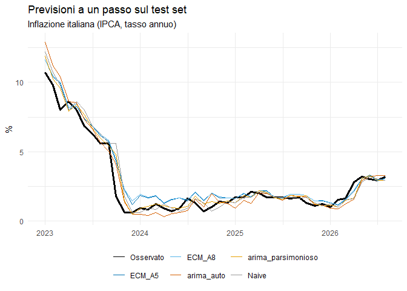
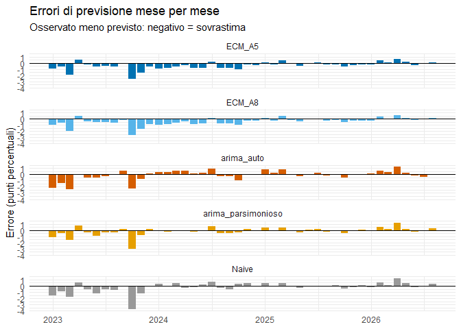

06 - Previsioni fuori campione e confronto ECM vs Benchmark
================

# Obiettivo del notebook

È il momento decisivo del progetto. Fino a qui è stata dimostrata una
relazione di cointegrazione (notebook 03), costruito un benchmark
univariato (notebook 04) e selezionata una specificazione ECM (notebook
05). Tutte quelle valutazioni sono però avvenute **dentro il campione di
stima**: AIC, BIC e test diagnostici misurano quanto bene un modello
descrive dati che ha già visto.

Qui si misura l’unica cosa che conta per un modello previsivo: **quanto
bene prevede dati che non ha mai visto**. Il test set (gennaio 2023 –
agosto 2026, 44 osservazioni) è rimasto intoccato dal notebook 02 in
avanti, proprio per questo momento.

La domanda: un modello che guarda all’Europa, al petrolio e al
meccanismo di correzione dell’equilibrio di lungo periodo batte un
modello che guarda soltanto alla propria storia passata?

# Caricamento di tutto il necessario

``` r
# Chunk: caricamento_dati
df_train        <- readRDS(here("Data", "Processed", "df_train.rds"))
df_test         <- readRDS(here("Data", "Processed", "df_test.rds"))
dati_ecm_train  <- readRDS(here("Data", "Processed", "dati_ecm_train.rds"))
dati_ecm_test   <- readRDS(here("Data", "Processed", "dati_ecm_test.rds"))
fit_benchmark   <- readRDS(here("Data", "Processed", "fit_benchmark.rds"))

cat("Test set:", nrow(df_test), "osservazioni |",
    as.character(min(df_test$date)), "->", as.character(max(df_test$date)), "\n")
```

    ## Test set: 44 osservazioni | 2023 gen -> 2026 ago

# Una precisazione necessaria: dove agisce la stazionarietà

Prima di entrare nel merito va chiarito un punto che potrebbe sembrare
in contraddizione con il notebook 02: **nessuno dei modelli stima su
dati non stazionari**. Cambia solo dove avviene la differenziazione e
chi la gestisce.

Il benchmark del notebook 04 è specificato come
`ARIMA(hicp_it ~ pdq(0:4, 1, 0:4) + PDQ(0:2, 0, 0:2))`. L’**1 al centro
di `pdq()`** è il parametro *d*, l’ordine di differenziazione, ed è
esattamente la conclusione dei test ADF/KPSS/Zivot-Andrews. La “I” di
ARIMA sta per *Integrated*: il modello riceve la serie in livello, la
differenzia internamente, stima la struttura ARMA sulla serie
differenziata — stazionaria — e re-integra automaticamente le previsioni
riportandole al livello.

|       | Input fornito                 | Dove si differenzia     | Su cosa si stima         | Output                              |
|-------|-------------------------------|-------------------------|--------------------------|-------------------------------------|
| ARIMA | livello `hicp_it`             | internamente (`d = 1`)  | `d_hicp_it`, stazionaria | livello, re-integrato in automatico |
| ECM   | `d_hicp_it` già differenziata | a monte, esplicitamente | `d_hicp_it`, stazionaria | variazione, da re-integrare a mano  |

**L’eccezione apparente: l’ECT.** L’ECM è l’unico modello del progetto
che contiene informazione di livello, attraverso il termine di
correzione d’errore. Non è una violazione del principio di stazionarietà
ma precisamente ciò che il teorema di rappresentazione di Granger
autorizza: il test di Johansen ha dimostrato che quella combinazione
lineare è **I(0)**, pur essendo I(1) ciascuna delle tre variabili. L’ECT
è dunque un regressore stazionario, e la regressione non è spuria. Senza
il risultato di cointegrazione, inserire quei livelli sarebbe stato un
errore grave.

# Metodologia: perché previsione a un passo

**Previsione a un passo (one-step-ahead).** Per ogni mese *t* del test
set il modello prevede il valore di *t* usando esclusivamente
informazione disponibile fino a *t−1*. Poi si avanza di un mese e si
ripete. È l’esercizio che riproduce la situazione reale di un previsore
che ogni mese aggiorna la stima con i dati appena pubblicati.

**Perché non una previsione dinamica sull’intero orizzonte.** L’ECM
contiene `ECT_l1`, che a sua volta contiene inflazione europea e prezzo
del petrolio del mese precedente. A un passo quei valori sono
genuinamente noti. Su un orizzonte lungo non lo sarebbero: bisognerebbe
prevedere anche `hicp_ea` e `brent` con modelli ausiliari — trasformando
l’esercizio in un test congiunto di tre modelli — oppure usare i valori
veri futuri, che è la scorrettezza informativa evitata nel notebook 05
separando le famiglie A e B.

**La condizione di equità.** Tutti i modelli ricevono lo stesso insieme
informativo: tutto ciò che è osservabile fino a *t−1*, niente di più.
L’ARIMA conosce la storia di `hicp_it`; l’ECM conosce in più la storia
di `hicp_ea`, `brent` e la deviazione dall’equilibrio. Questa differenza
è precisamente ciò che si sta testando.

**Coefficienti congelati.** Nessun modello viene ristimato sui dati del
test set. I parametri restano quelli stimati fino a dicembre 2022.

# Ricostruzione della serie completa

``` r
# Chunk: serie_completa
# Ricomponiamo la serie completa in livello. Serve per due scopi:
# 1. la previsione ECM produce una VARIAZIONE (d_hicp_it): per riportarla al
#    livello serve hicp_it del mese precedente;
# 2. il benchmark ARIMA va riapplicato alla serie intera, non al solo test set,
#    altrimenti la differenza interna (d = 1) perderebbe l'aggancio al valore
#    di dicembre 2022.
serie_completa_liv <- bind_rows(
  df_train %>% as_tibble(),
  df_test  %>% as_tibble()
) %>%
  arrange(date) %>%
  mutate(
    date    = yearmonth(date),
    hicp_it = as.numeric(hicp_it)
  )

# Livello ritardato di un mese: e' la base su cui si innesta la variazione
# prevista dall'ECM
livelli_ritardati <- serie_completa_liv %>%
  mutate(hicp_it_l1 = dplyr::lag(hicp_it, 1)) %>%
  dplyr::select(date, hicp_it, hicp_it_l1)
```

# Previsioni dei modelli ECM

``` r
# Chunk: previsione_ecm
# Confrontiamo DUE specificazioni ECM, come deciso nel notebook 05:
# - A8_con_brent: miglior AIC fra i candidati validi (la regola di selezione)
# - A5_stagionale: miglior BIC, piu' parsimonioso, ΔAIC sotto la soglia di
#   equivalenza. I due sono indistinguibili in-sample: decide il test set.
specifiche_ecm <- list(
  ECM_A5 = c("ECT_l1", "d_hicp_it_l1", "d_hicp_ea_l1", "d_hicp_it_l12"),
  ECM_A8 = c("ECT_l1", "d_hicp_it_l1", "d_hicp_it_l2", "d_hicp_ea_l1",
             "d_hicp_it_l12", "dlog_brent_l1")
)

# Per ciascuna specificazione: stima sul train, previsione a un passo sul test,
# re-integrazione al livello.
prev_ecm_lista <- imap(specifiche_ecm, function(regs, nome) {

  dati_stima <- dati_ecm_train %>%
    tidyr::drop_na(all_of(c("d_hicp_it", regs)))

  mod <- lm(reformulate(regs, response = "d_hicp_it"), data = dati_stima)

  # predict() sul test set usa i valori RITARDATI OSSERVATI: ogni previsione
  # impiega solo informazione disponibile fino al mese precedente. E' quindi
  # una previsione a un passo genuina, non un fitting in-sample.
  dati_ecm_test %>%
    mutate(prev_diff = predict(mod, newdata = .)) %>%
    dplyr::select(date, prev_diff) %>%
    left_join(livelli_ritardati, by = "date") %>%
    # Re-integrazione: al livello OSSERVATO del mese precedente sommiamo la
    # variazione prevista.
    mutate(!!nome := hicp_it_l1 + prev_diff) %>%
    dplyr::select(date, all_of(nome))
})

prev_ecm <- reduce(prev_ecm_lista, left_join, by = "date")

head(prev_ecm)
```

    ## # A tibble: 6 × 3
    ##       date ECM_A5 ECM_A8
    ##      <mth>  <dbl>  <dbl>
    ## 1 2023 gen  11.6   11.6 
    ## 2 2023 feb  10.4   10.5 
    ## 3 2023 mar   9.92  10.0 
    ## 4 2023 apr   8.06   8.20
    ## 5 2023 mag   8.28   8.43
    ## 6 2023 giu   7.40   7.36

**Il passaggio dalla variazione al livello (re-integrazione).** L’ECM è
stimato su `d_hicp_it`, quindi prevede di quanto l’inflazione cambierà
rispetto al mese precedente, non quale sarà il suo valore. È la stessa
operazione che `fable` esegue internamente per l’ARIMA: qui va fatta
esplicitamente, perché `lm()` non sa che la variabile dipendente è una
differenza.

$$\widehat{hicp\_it}_t = hicp\_it_{t-1} + \widehat{\Delta hicp\_it}_t$$

Usare il livello **osservato** (non quello precedentemente previsto) è
ciò che rende l’esercizio genuinamente a un passo: ogni previsione
riparte dal dato reale più recente, senza accumulare errori da un mese
all’altro. È anche il motivo per cui il confronto è simmetrico rispetto
all’ARIMA, che internamente fa la stessa cosa.

# Previsioni dei benchmark ARIMA

``` r
# Chunk: previsione_benchmark
# refit() riapplica i modelli gia' stimati a una serie piu' lunga SENZA
# ristimare i coefficienti (reestimate = FALSE): i parametri restano quelli
# del train. fitted() restituisce poi le previsioni a un passo lungo tutta la
# serie. fit_benchmark contiene ENTRAMBI i modelli del notebook 04, quindi
# li confrontiamo tutti e due (arima_auto ha radici quasi cancellate: un
# fattore di rischio proprio fuori campione).
serie_completa_ts <- serie_completa_liv %>%
  as_tsibble(index = date) %>%
  tsibble::fill_gaps()

fit_refit <- fit_benchmark %>%
  refit(serie_completa_ts, reestimate = FALSE)

prev_arima <- fitted(fit_refit) %>%
  as_tibble() %>%
  dplyr::select(date, .model, .fitted) %>%
  pivot_wider(names_from = .model, values_from = .fitted)

head(prev_arima)
```

    ## # A tibble: 6 × 3
    ##       date arima_auto arima_parsimonioso
    ##      <mth>      <dbl>              <dbl>
    ## 1 1997 gen       2.80               2.80
    ## 2 1997 feb       2.74               2.78
    ## 3 1997 mar       2.32               2.35
    ## 4 1997 apr       2.12               2.16
    ## 5 1997 mag       1.86               1.97
    ## 6 1997 giu       1.63               1.76

**Perché `refit()` sulla serie intera e non `forecast()` sul test set.**
Sono due esercizi diversi. `forecast(h = 44)` produrrebbe una previsione
**dinamica**: dal punto di partenza di dicembre 2022 il modello
proietterebbe 44 mesi in avanti alimentandosi delle proprie previsioni,
senza mai vedere un dato reale. Sarebbe un confronto sbilanciato contro
un ECM che prevede a un passo.

`refit(..., reestimate = FALSE)` riapplica il modello con i coefficienti
congelati, e `fitted()` ne estrae le previsioni a un passo: ogni valore
usa solo l’informazione fino al mese precedente, esattamente come l’ECM.

L’applicazione alla serie intera, e non al solo test set, è un dettaglio
tecnico necessario: l’ARIMA ha `d = 1` al suo interno, quindi per
prevedere gennaio 2023 gli serve il valore di dicembre 2022, che
appartiene al train.

# Benchmark naive: il pavimento assoluto

``` r
# Chunk: previsione_naive
# Random walk: la previsione per il mese t e' semplicemente il valore osservato
# in t-1. Non richiede alcuna stima.
prev_naive <- livelli_ritardati %>%
  dplyr::select(date, Naive = hicp_it_l1)
```

Il modello naive prevede che l’inflazione di questo mese sia uguale a
quella del mese scorso. Non ha parametri, non richiede stima, e sulle
serie macroeconomiche mensili è notoriamente difficile da battere.

Includerlo è una forma di onestà intellettuale: se un modello
econometrico con sei regressori non supera “il valore di ieri”, non sta
aggiungendo valore previsivo, per quanto eleganti siano le sue
proprietà. È il controllo che separa un risultato vero da un risultato
apparente.

# Unione delle previsioni

``` r
# Chunk: unione_previsioni
confronto <- prev_ecm %>%
  left_join(prev_arima, by = "date") %>%
  left_join(prev_naive, by = "date") %>%
  left_join(livelli_ritardati %>% dplyr::select(date, hicp_it), by = "date") %>%
  dplyr::filter(date > yearmonth("2022-12")) %>%
  tidyr::drop_na()

nomi_modelli <- setdiff(names(confronto), c("date", "hicp_it"))

# Formato lungo: una riga per (mese, modello), con l'errore gia' calcolato.
# Rende tutte le elaborazioni successive indipendenti dal numero di modelli.
confronto_lungo <- confronto %>%
  pivot_longer(all_of(nomi_modelli), names_to = "modello", values_to = "previsto") %>%
  mutate(errore = hicp_it - previsto)

cat("Osservazioni valutate:", nrow(confronto), "|",
    as.character(min(confronto$date)), "->", as.character(max(confronto$date)), "\n")
```

    ## Osservazioni valutate: 44 | 2023 gen -> 2026 ago

``` r
cat("Modelli confrontati:", paste(nomi_modelli, collapse = ", "), "\n")
```

    ## Modelli confrontati: ECM_A5, ECM_A8, arima_auto, arima_parsimonioso, Naive

``` r
confronto %>% head(12)
```

    ## # A tibble: 12 × 7
    ##        date ECM_A5 ECM_A8 arima_auto arima_parsimonioso Naive hicp_it
    ##       <mth>  <dbl>  <dbl>      <dbl>              <dbl> <dbl>   <dbl>
    ##  1 2023 gen  11.6   11.6      12.9               11.9    12.2    10.7
    ##  2 2023 feb  10.4   10.5      11.2               10.2    10.7     9.8
    ##  3 2023 mar   9.92  10.0      10.4                9.56    9.8     8  
    ##  4 2023 apr   8.06   8.20      8.60               7.91    8       8.6
    ##  5 2023 mag   8.28   8.43      8.51               8.38    8.6     8  
    ##  6 2023 giu   7.40   7.36      7.30               7.67    8       6.8
    ##  7 2023 lug   6.80   6.86      6.63               6.70    6.8     6.3
    ##  8 2023 ago   6.15   6.26      5.69               5.98    6.3     5.6
    ##  9 2023 set   5.72   5.79      5.03               5.42    5.6     5.6
    ## 10 2023 ott   4.33   4.47      4.10               4.79    5.6     1.8
    ## 11 2023 nov   2.23   2.27      1.35               1.42    1.8     0.6
    ## 12 2023 dic   1.17   1.42      0.481              0.458   0.6     0.6

# Metriche di accuratezza

``` r
# Chunk: metriche
# RMSE: radice dell'errore quadratico medio. Penalizza quadraticamente gli
#       errori grandi, quindi e' sensibile ai mesi di shock.
# MAE:  errore assoluto medio. Tratta tutti gli errori linearmente, quindi e'
#       piu' robusto agli outlier.
# ME:   errore medio con segno. Misura la DISTORSIONE (bias): se e' lontano da
#       zero, il modello sbaglia sistematicamente in una direzione.
metriche <- confronto_lungo %>%
  group_by(modello) %>%
  summarise(
    RMSE = round(sqrt(mean(errore^2)), 4),
    MAE  = round(mean(abs(errore)), 4),
    ME   = round(mean(errore), 4),
    .groups = "drop"
  ) %>%
  arrange(RMSE)

metriche
```

    ## # A tibble: 5 × 4
    ##   modello             RMSE   MAE     ME
    ##   <chr>              <dbl> <dbl>  <dbl>
    ## 1 arima_parsimonioso 0.660 0.414 -0.184
    ## 2 ECM_A5             0.726 0.537 -0.412
    ## 3 ECM_A8             0.758 0.555 -0.448
    ## 4 arima_auto         0.78  0.519 -0.106
    ## 5 Naive              0.817 0.496 -0.204

Le tre metriche non sono ridondanti, e guardarle insieme evita
conclusioni affrettate:

-   **RMSE** penalizza quadraticamente: un modello con molti errori
    piccoli ma un paio di errori enormi viene punito duramente. È la
    metrica standard, ma su un periodo turbolento può essere dominata da
    pochi mesi.
-   **MAE** tratta tutti gli errori linearmente ed è quindi più robusto.
    Se RMSE e MAE danno classifiche **diverse**, significa che un
    modello sbaglia raramente ma in modo grave mentre l’altro sbaglia
    spesso ma poco.
-   **ME** non misura l’accuratezza ma la **distorsione**. Un ME vicino
    a zero indica errori che si compensano; un ME negativo significa che
    il modello **sovrastima** sistematicamente.

## Interpretazione dei risultati

| Modello                | RMSE       | MAE        | ME          |
|------------------------|------------|------------|-------------|
| **arima_parsimonioso** | **0.6598** | **0.4143** | −0.1840     |
| ECM_A5                 | 0.7260     | 0.5373     | −0.4116     |
| ECM_A8                 | 0.7583     | 0.5548     | −0.4478     |
| arima_auto             | 0.7800     | 0.5186     | **−0.1063** |
| Naive                  | 0.8174     | 0.4955     | −0.2045     |

**Il modello più accurato è `arima_parsimonioso`**,
l’ARIMA(0,1,2)(0,0,1)\[12\] costruito a mano sulla base dell’ACF/PACF.
Vince su **entrambe** le metriche di accuratezza, e non di misura:
rispetto al miglior ECM riduce l’RMSE del 9.1% e il MAE del 22.9%.

L’ordine completo su RMSE — `arima_parsimonioso` \< ECM_A5 \< ECM_A8 \<
`arima_auto` \< Naive — dice due cose importanti e distinte.

**Primo: l’ECM non batte il benchmark.** L’ipotesi centrale del progetto
non è confermata su questo test set. L’informazione aggiuntiva su
inflazione europea, petrolio e meccanismo di correzione non si traduce
in previsioni più accurate rispetto a un modello che guarda solo alla
propria storia. L’ECM batte il naive sull’RMSE (0.7260 contro 0.8174) ma
non sul MAE, e resta comunque dietro all’ARIMA parsimonioso su entrambe.

**Secondo: due modelli su due hanno premiato la parsimonia fuori
campione.** È il risultato metodologico più netto, e vale la pena
esaminarlo a parte.

### La lezione sulla selezione dei modelli

Confrontando come i modelli erano stati ordinati in-sample con come si
comportano fuori campione emerge uno schema coerente:

| Coppia                               | Vincitore in-sample       | Vincitore out-of-sample              |
|--------------------------------------|---------------------------|--------------------------------------|
| `arima_auto` vs `arima_parsimonioso` | arima_auto (ΔAICc = 35.6) | **arima_parsimonioso** (RMSE −15.4%) |
| ECM_A8 vs ECM_A5                     | A8 (ΔAIC = 0.76)          | **A5** (RMSE −4.3%)                  |

**Il caso ARIMA è il più istruttivo.** In-sample `arima_auto` dominava
con 35.6 punti di AICc, un margine che secondo la regola convenzionale
rende il modello alternativo “empiricamente trascurabile”. Fuori
campione perde del 15.4%.

Questo non è un caso fortunato: nel notebook 04 il problema era stato
**diagnosticato in anticipo**. I coefficienti `ar1 = 0.9682` e
`ma1 = −0.9662` indicavano radici quasi cancellate, con due parametri
che si elidono e restano quindi mal identificati. Era stato scritto
allora che modelli con questa caratteristica “tendono a comportarsi
peggio fuori campione di quanto l’AICc suggerisca”. È esattamente ciò
che è accaduto.

È una dimostrazione da manuale del fatto che i **criteri informativi
misurano l’adattamento ai dati osservati, non la capacità predittiva**,
e che una diagnostica sulla struttura dei coefficienti può contraddirli
— correttamente.

**Il caso ECM conferma lo schema.** L’AIC preferiva A8 di 0.76 punti, il
BIC preferiva A5 di 6.63. Fuori campione vince A5. Il criterio più
severo verso la complessità aveva ragione, e la decisione presa nel
notebook 05 di portare entrambi i modelli al confronto invece di fidarsi
della sola regola dell’AIC si è rivelata corretta.

**La sintesi**: in tutti e due i confronti il modello più semplice ha
vinto fuori campione. È un messaggio coerente e riportabile in tesi.

### Il bias dell’ECM

Sul bias (ME) i due ECM sono nettamente i peggiori: −0.4116 e −0.4478,
contro −0.1063 dell’`arima_auto` e −0.1840 dell’`arima_parsimonioso`.
Tutti i modelli sovrastimano l’inflazione, ma gli ECM lo fanno in misura
da due a quattro volte maggiore. La sezione seguente spiega perché, e la
ragione è strutturale.

### Perché l’ECM sovrastima sistematicamente

La spiegazione è strutturale e merita un posto nelle conclusioni della
tesi.

L’ECT spinge l’inflazione italiana verso il livello implicato dalla
relazione di lungo periodo stimata sul campione 1997–2022:

$$hicp\_it^{eq} \approx 1.3431 \cdot hicp\_ea - 0.2912 \cdot \log(brent) + 0.6248$$

Con i valori tipici del 2024–2025 — inflazione dell’area euro fra il
2.2% e il 2.4% e Brent attorno a 70 EUR/barile — quella formula implica
un’inflazione italiana di equilibrio fra il **2.3% e il 2.6%**.
L’inflazione italiana effettivamente osservata in quel periodo si è
mantenuta invece fra l’**1% e l’1.5%**: uno scarto persistente di oltre
un punto percentuale.

Il risultato è che l’ECT resta persistentemente negativo, e il
meccanismo di correzione — con coefficiente negativo — genera mese dopo
mese una spinta al rialzo verso un equilibrio a cui l’inflazione
italiana non è mai tornata. Il grafico delle previsioni lo mostra
chiaramente: la linea dell’ECM sta costantemente **sopra** quella
osservata per tutto il 2024 e il 2025.

**L’implicazione è importante**: questo comportamento suggerisce che la
relazione di lungo periodo fra inflazione italiana ed europea possa aver
subito un **cambiamento strutturale dopo il 2022**. Nel periodo
post-shock energetico l’Italia ha mostrato un’inflazione
sistematicamente inferiore a quella che la relazione storica, con la sua
trasmissione amplificata di 1.34, prevedeva. Non è un difetto di
implementazione del modello: è un risultato sostanziale sul periodo
studiato, e come tale va presentato.

# Il miglioramento è statisticamente significativo?

``` r
# Chunk: test_diebold_mariano
# Test di Diebold-Mariano: verifica se la differenza di accuratezza fra due
# modelli e' statisticamente significativa o attribuibile al caso.
#
# Implementazione: si costruisce il differenziale di perdita
# d_t = |e1_t|^p - |e2_t|^p e lo si regredisce su una costante. Se la media di
# d_t e' significativamente diversa da zero, i due modelli hanno accuratezza
# diversa. La varianza e' calcolata con stimatore HAC, perche' i differenziali
# di perdita sono tipicamente autocorrelati.
#
# H0: i due modelli hanno pari accuratezza previsiva.
test_dm <- function(dati, mod1, mod2, potenza = 2, ritardi = 3) {

  e1 <- dati$errore[dati$modello == mod1]
  e2 <- dati$errore[dati$modello == mod2]

  d     <- abs(e1)^potenza - abs(e2)^potenza
  mod_d <- lm(d ~ 1)
  ct    <- coeftest(mod_d, vcov = NeweyWest(mod_d, lag = ritardi, prewhite = FALSE))

  tibble(
    confronto  = paste(mod1, "vs", mod2),
    perdita    = ifelse(potenza == 2, "quadratica (RMSE)", "assoluta (MAE)"),
    diff_media = round(as.numeric(ct[1, "Estimate"]), 5),
    stat_DM    = round(as.numeric(ct[1, "t value"]), 3),
    p_value    = round(as.numeric(ct[1, "Pr(>|t|)"]), 4),
    esito      = ifelse(as.numeric(ct[1, "Pr(>|t|)"]) < 0.05,
                        "Differenza significativa",
                        "Nessuna differenza significativa")
  )
}

# Confronti chiave: il miglior ECM contro ciascun benchmark, su entrambe le
# funzioni di perdita, piu' il confronto fra i due benchmark.
miglior_ecm <- metriche %>%
  dplyr::filter(str_starts(modello, "ECM")) %>%
  slice_min(RMSE, n = 1) %>% pull(modello)

miglior_arima <- metriche %>%
  dplyr::filter(str_starts(modello, "arima")) %>%
  slice_min(RMSE, n = 1) %>% pull(modello)

risultati_dm <- bind_rows(
  test_dm(confronto_lungo, miglior_ecm,   miglior_arima, potenza = 2),
  test_dm(confronto_lungo, miglior_ecm,   miglior_arima, potenza = 1),
  test_dm(confronto_lungo, miglior_ecm,   "Naive",       potenza = 2),
  test_dm(confronto_lungo, miglior_ecm,   "Naive",       potenza = 1),
  test_dm(confronto_lungo, miglior_arima, "Naive",       potenza = 2)
)

risultati_dm
```

    ## # A tibble: 5 × 6
    ##   confronto                    perdita          diff_media stat_DM p_value esito
    ##   <chr>                        <chr>                 <dbl>   <dbl>   <dbl> <chr>
    ## 1 ECM_A5 vs arima_parsimonioso quadratica (RMS…     0.0917   1.22   0.228  Ness…
    ## 2 ECM_A5 vs arima_parsimonioso assoluta (MAE)       0.123    2.02   0.0501 Ness…
    ## 3 ECM_A5 vs Naive              quadratica (RMS…    -0.141   -0.822  0.416  Ness…
    ## 4 ECM_A5 vs Naive              assoluta (MAE)       0.0419   0.641  0.525  Ness…
    ## 5 arima_parsimonioso vs Naive  quadratica (RMS…    -0.233   -1.71   0.0947 Ness…

**Perché questo test è necessario.** Un RMSE più basso, da solo, non
dimostra nulla: una differenza modesta può essere puro rumore
campionario. Il test di Diebold-Mariano è lo strumento standard in
letteratura per stabilire se una differenza di accuratezza previsiva è
distinguibile dal caso. Un `diff_media` negativo indica che il primo
modello ha perdita minore; il p-value dice se la differenza è reale.

## Interpretazione

| Confronto                    | Perdita    | Differenza media | t          | p-value    |
|------------------------------|------------|------------------|------------|------------|
| ECM_A5 vs arima_parsimonioso | quadratica | +0.0917          | +1.223     | 0.228      |
| ECM_A5 vs arima_parsimonioso | assoluta   | **+0.1231**      | **+2.016** | **0.0501** |
| ECM_A5 vs Naive              | quadratica | −0.1412          | −0.822     | 0.416      |
| ECM_A5 vs Naive              | assoluta   | +0.0419          | +0.641     | 0.525      |
| arima_parsimonioso vs Naive  | quadratica | −0.2329          | −1.709     | 0.0947     |

Il segno indica chi vince: **positivo** significa che il primo modello
ha perdita *maggiore*, cioè prevede **peggio**.

**Il risultato più vicino alla significatività è sfavorevole all’ECM.**
Nel confronto sulla perdita assoluta contro l’ARIMA parsimonioso, la
statistica DM vale 2.016 con p-value **0.0501** — esattamente sulla
soglia convenzionale del 5%. Il segno è positivo, quindi indica che
**l’ECM prevede peggio**. È l’unico confronto di tutta la tabella che si
avvicina a essere statisticamente concludente, e va nella direzione
opposta all’ipotesi del progetto.

Formalmente H0 non viene rifiutata, dato che 0.0501 \> 0.05 — per un
millesimo. La formulazione corretta in tesi è che *la differenza è al
limite della significatività convenzionale*, non che sia significativa
né che sia assente.

**Il secondo risultato più forte riguarda il benchmark contro il
naive**: l’ARIMA parsimonioso riduce l’RMSE rispetto al random walk con
p = 0.0947, significativo al 10% ma non al 5%. Anche qui la direzione è
chiara.

**Sui confronti fra ECM e naive nulla è concludente.** L’ECM è migliore
sulla perdita quadratica (p = 0.416) e peggiore su quella assoluta (p =
0.525), senza che nessuna delle due differenze sia distinguibile dal
caso.

**Il limite di potenza resta.** Con 44 osservazioni il test DM rileva
solo differenze marcate: può non rifiutare H0 anche quando una
differenza reale esiste. Questo è il principale limite del disegno
sperimentale, e la sezione finale indica come superarlo.

# Visualizzazione

``` r
# Chunk: grafico_previsioni
# Palette Okabe-Ito, sicura per daltonismo e coerente con il resto del progetto.
colori_modelli <- c(
  Osservato            = "#000000",
  ECM_A5               = "#0072B2",
  ECM_A8               = "#56B4E9",
  arima_auto           = "#D55E00",
  arima_parsimonioso   = "#E69F00",
  Naive                = "grey60"
)

confronto %>%
  rename(Osservato = hicp_it) %>%
  pivot_longer(-date, names_to = "serie", values_to = "valore") %>%
  mutate(serie = factor(serie, levels = names(colori_modelli))) %>%
  ggplot(aes(x = as.Date(date), y = valore, colour = serie,
             linewidth = serie == "Osservato")) +
  geom_line() +
  scale_linewidth_manual(values = c(`TRUE` = 1.1, `FALSE` = 0.6), guide = "none") +
  scale_colour_manual(values = colori_modelli, na.translate = FALSE) +
  labs(title = "Previsioni a un passo sul test set",
       subtitle = "Inflazione italiana (IPCA, tasso annuo)",
       x = NULL, y = "%", colour = NULL) +
  theme_minimal() +
  theme(legend.position = "bottom")
```

<!-- -->

**Cosa mostra il grafico.** Tutti i modelli seguono da vicino la discesa
dell’inflazione dal picco del 2023, con lo scarto maggiore concentrato
nei primi mesi e nella caduta brusca di ottobre 2023 (da 5.6% a 1.8% in
un solo mese), che nessun modello anticipa.

Il dettaglio più rivelatore è il **comportamento nel 2024–2025**: le due
linee azzurre degli ECM restano sistematicamente sopra quella osservata,
mentre l’ARIMA parsimonioso e il naive le si sovrappongono da vicino. È
la traduzione visiva del bias discusso sopra, e spiega gran parte del
divario sul MAE.

``` r
# Chunk: grafico_errori
# Un pannello per modello: con piu' di tre serie le barre affiancate
# diventerebbero illeggibili.
confronto_lungo %>%
  mutate(modello = factor(modello, levels = names(colori_modelli))) %>%
  ggplot(aes(x = as.Date(date), y = errore, fill = modello)) +
  geom_col() +
  geom_hline(yintercept = 0) +
  facet_wrap(~ modello, ncol = 1) +
  scale_fill_manual(values = colori_modelli, guide = "none") +
  labs(title = "Errori di previsione mese per mese",
       subtitle = "Osservato meno previsto: negativo = sovrastima",
       x = NULL, y = "Errore (punti percentuali)") +
  theme_minimal()
```

<!-- -->

**Cosa cercare.** Il grafico degli errori è spesso più informativo di
quello delle previsioni, perché mostra **dove** si concentrano le
differenze. Due osservazioni emergono con chiarezza:

-   tutti i modelli sbagliano negli **stessi mesi critici** — inizio
    2023 e ottobre 2023 — segno che quegli shock erano imprevedibili per
    chiunque; ma il naive sbaglia molto di più (−3.8 punti a ottobre
    2023 contro −2.5 dell’ECM);
-   nel periodo calmo le barre dell’ECM sono **quasi tutte dello stesso
    segno** (negative, cioè sovrastima), mentre quelle degli altri
    modelli si alternano attorno allo zero. Errori sistematicamente
    sbilanciati da un lato sono la firma di una distorsione, non di
    rumore casuale.

# Accuratezza per sotto-periodo

``` r
# Chunk: metriche_per_anno
# Il test set attraversa fasi macroeconomiche molto diverse: il rientro
# dall'inflazione record del 2022, poi due anni di stabilita', poi una ripresa
# nel 2026. Scomporre per anno mostra se il vantaggio di un modello e' stabile
# o concentrato in una fase specifica.
metriche_anno <- confronto_lungo %>%
  mutate(anno = lubridate::year(as.Date(date))) %>%
  group_by(anno, modello) %>%
  summarise(n = n(), RMSE = round(sqrt(mean(errore^2)), 4), .groups = "drop") %>%
  pivot_wider(names_from = modello, values_from = RMSE)

# Vincitore per ciascun anno
vincitori <- confronto_lungo %>%
  mutate(anno = lubridate::year(as.Date(date))) %>%
  group_by(anno, modello) %>%
  summarise(RMSE = sqrt(mean(errore^2)), .groups = "drop_last") %>%
  slice_min(RMSE, n = 1) %>%
  ungroup() %>%
  dplyr::select(anno, vincitore = modello)

metriche_anno %>% left_join(vincitori, by = "anno")
```

    ## # A tibble: 4 × 8
    ##    anno     n ECM_A5 ECM_A8 Naive arima_auto arima_parsimonioso vincitore       
    ##   <dbl> <int>  <dbl>  <dbl> <dbl>      <dbl>              <dbl> <chr>           
    ## 1  2023    12  1.14   1.20  1.45       1.28               1.13  arima_parsimoni…
    ## 2  2024    12  0.685  0.715 0.369      0.501              0.316 arima_parsimoni…
    ## 3  2025    12  0.301  0.302 0.233      0.389              0.267 Naive           
    ## 4  2026     8  0.328  0.285 0.505      0.551              0.463 ECM_A8

## Interpretazione per sotto-periodo

| Anno | n   | arima_pars | ECM_A5 | ECM_A8     | arima_auto | Naive      | Vincitore  | Contesto macro                         |
|------|-----|------------|--------|------------|------------|------------|------------|----------------------------------------|
| 2023 | 12  | **1.1323** | 1.1408 | 1.2048     | 1.2751     | 1.4457     | arima_pars | disinflazione dal picco (10.7% → 0.6%) |
| 2024 | 12  | **0.3160** | 0.6846 | 0.7150     | 0.5010     | 0.3686     | arima_pars | inflazione stabile attorno all’1%      |
| 2025 | 12  | 0.2670     | 0.3006 | 0.3022     | 0.3888     | **0.2327** | Naive      | inflazione stabile attorno all’1.5%    |
| 2026 | 8   | 0.4628     | 0.3284 | **0.2853** | 0.5513     | 0.5050     | **ECM_A8** | risalita verso il 3%                   |

*(La riga del 2026 copre 8 mesi, non 12: il campione termina ad agosto
2026.)*

**L’ARIMA parsimonioso vince due anni su quattro**, compreso il 2023 —
l’anno della grande disinflazione, dove ci si sarebbe aspettati il
vantaggio maggiore del meccanismo di correzione. Lo fa però con un
margine minimo sull’ECM_A5 (1.1323 contro 1.1408, meno dell’1%), quindi
su quell’anno i due modelli sono di fatto alla pari. Nel 2024 il suo
vantaggio è invece netto: 0.3160 contro 0.6846 dell’ECM, meno della metà
dell’errore.

**Il naive vince il 2025**, l’anno più tranquillo del campione. Conferma
il principio noto: quando una serie si muove poco, “il valore del mese
scorso” è un concorrente difficilissimo, e qualunque struttura
aggiuntiva rischia di essere solo rumore.

**L’unico anno in cui un ECM vince è il 2026**, con `ECM_A8` a 0.2853
contro 0.4628 dell’ARIMA parsimonioso — un margine ampio, quasi il 40%
di errore in meno. È anche l’anno in cui l’inflazione italiana risale
dall’1% verso il 3%, cioè l’unica fase di movimento al rialzo del test
set.

**Come leggere questo schema, con la cautela necessaria.** La lettura
suggestiva è che l’ECM dia il meglio quando il sistema si muove verso
l’equilibrio dall’alto o dal basso, e il peggio quando l’inflazione è
piatta. Il comportamento del 2026 e quello del 2024–2025 sono coerenti
con questa idea.

Ma la prudenza è d’obbligo per due ragioni. La prima è che il 2026 conta
solo **otto osservazioni**: un RMSE calcolato su otto mesi è molto
instabile e non basta a fondare una conclusione. La seconda è che nel
2023 — la fase di movimento più drammatica dell’intero campione, e
quindi il vero banco di prova dell’ipotesi — l’ECM **non** vince, pur
restando sostanzialmente alla pari.

In tesi questa sezione va quindi presentata come **osservazione
esplorativa da verificare**, non come risultato stabilito. È esattamente
il tipo di ipotesi che una validazione incrociata su molte più
osservazioni potrebbe confermare o smentire.

``` r
# Chunk: salvataggio
saveRDS(confronto,       here("Data", "Processed", "confronto_previsioni.rds"))
saveRDS(confronto_lungo, here("Data", "Processed", "confronto_previsioni_lungo.rds"))
saveRDS(metriche,        here("Data", "Processed", "metriche_accuratezza.rds"))
saveRDS(risultati_dm,    here("Data", "Processed", "test_diebold_mariano.rds"))

write_csv(confronto,     here("Output", "confronto_previsioni.csv"))
write_csv(metriche,      here("Output", "metriche_accuratezza.csv"))
write_csv(risultati_dm,  here("Output", "test_diebold_mariano.csv"))
```

# Conclusioni

## L’ipotesi centrale non è confermata

L’obiettivo del progetto era verificare se un modello che incorpora
l’informazione sull’inflazione dell’area euro, sul prezzo del petrolio e
sulla deviazione dall’equilibrio di lungo periodo prevedesse
l’inflazione italiana meglio di un modello univariato. **Su questo test
set la risposta è negativa.**

Il modello più accurato è `arima_parsimonioso`, un
ARIMA(0,1,2)(0,0,1)\[12\] che usa esclusivamente la storia passata di
`hicp_it`. Batte il miglior ECM del 9.1% sull’RMSE e del 22.9% sul MAE,
e la differenza sulla perdita assoluta è al limite della significatività
statistica (p = 0.0501).

Questo risultato non è anomalo nella letteratura sulla previsione
dell’inflazione, dove è ampiamente documentato che modelli strutturali
ricchi faticano a superare benchmark univariati semplici. Il riferimento
classico è Atkeson e Ohanian (2001), che mostrarono come previsioni
ingenue battessero quelle basate sulla curva di Phillips; Stock e Watson
hanno successivamente confermato la difficoltà in diversi lavori.
**Inserire questo risultato nel contesto di quella letteratura è il modo
corretto di presentarlo in tesi**: non come un fallimento del lavoro, ma
come una replica su dati italiani di una regolarità nota.

## Cosa invece è stato dimostrato

1.  **Esiste una relazione di cointegrazione** fra inflazione italiana,
    europea e prezzo del petrolio, con trasmissione di lungo periodo
    amplificata (1.34) e un meccanismo di correzione rapido. La velocità
    di aggiustamento è stimata tre volte nel progetto, con risultati
    molto vicini fra loro: **22.3%** al mese dalla matrice dei pesi di
    Johansen (notebook 03, semivita 2.7 mesi), **23.9%** dall’ECM_A5 e
    **25.8%** dall’ECM_A8 (notebook 05, semivita 2.5 e 2.3 mesi). Tre
    stimatori diversi collocano il riassorbimento fra un quinto e un
    quarto dello squilibrio al mese. Il risultato è statisticamente
    solido, robusto a un cambio di valuta e a una revisione metodologica
    della serie target, e **resta valido indipendentemente dalla
    performance previsiva**: descrive una proprietà strutturale dei
    dati, non una capacità di previsione.

2.  **La componente stagionale annuale** è una caratteristica
    strutturale individuata per due vie modellistiche distinte: il
    benchmark SARIMA del notebook 04 — anticipato dalla lettura
    dell’ACF/PACF, che però è una lettura della stessa serie e non una
    prova separata — e la selezione di specificazione ECM del notebook
    05, che vi arriva attraverso un criterio completamente diverso. I
    coefficienti stimati sono `sma1` = −0.2552 e −0.3458 per i due
    SARIMA e −0.2939 per l’ECM: tre valori in un intervallo ristretto,
    da impianti modellistici che non condividono né la variabile
    dipendente né il criterio di selezione.

3.  **I criteri informativi non predicono la performance fuori
    campione.** `arima_auto` dominava in-sample di 35.6 punti di AICc e
    perde fuori campione del 15.4%. La diagnostica sulle radici quasi
    cancellate, fatta nel notebook 04, aveva anticipato correttamente il
    problema. Lo stesso schema si ripete sull’ECM, dove il BIC (che
    preferiva A5) aveva ragione e l’AIC (che preferiva A8) torto. In
    entrambi i casi **ha vinto la parsimonia**.

4.  **L’ECM mostra una distorsione sistematica al rialzo** (ME = −0.41)
    con una spiegazione strutturale: l’equilibrio stimato sul campione
    1997–2022 implica un’inflazione italiana attorno al 2.3% nelle
    condizioni del 2024–2025, mentre il valore osservato è stato attorno
    all’1%. Il meccanismo di correzione spinge verso un equilibrio a cui
    la serie non è tornata. È un indizio di **possibile cambiamento
    strutturale nella relazione Italia–area euro dopo il 2022**, ed è
    un’ipotesi verificabile con un test formale.

## Limiti del lavoro

1.  **Potenza statistica insufficiente.** Con 44 osservazioni il test di
    Diebold-Mariano rileva solo differenze marcate. Quasi tutti i
    confronti restano inconcludenti, e questo impedisce di stabilire con
    certezza non solo se l’ECM sia peggiore, ma anche di quanto.
2.  **Il test set copre un periodo atipico**: la discesa da
    un’inflazione record, due anni di stabilità insolita e una risalita.
    Le conclusioni sono condizionate a questo regime.
3.  **Il presunto vantaggio dell’ECM nelle fasi di movimento** resta
    un’osservazione esplorativa: si fonda su un solo anno (2026) con
    otto osservazioni, e non trova conferma nel 2023.

## Direzione prioritaria per un’estensione

Una **validazione incrociata a finestra espansiva** su tutto il campione
produrrebbe oltre 190 errori di previsione invece di 44, restituendo al
test di Diebold-Mariano una potenza reale. È l’estensione che
trasformerebbe i “non concludente” di questo notebook in verdetti veri,
e permetterebbe di verificare con dati sufficienti l’ipotesi sulla
performance condizionale alle fasi macroeconomiche.

# Sintesi delle decisioni metodologiche

| Decisione                                          | Motivazione                                                                                                                                              |
|----------------------------------------------------|----------------------------------------------------------------------------------------------------------------------------------------------------------|
| Previsione a un passo, non dinamica                | L’ECM richiede `hicp_ea` e `brent` ritardati: a un passo sono noti, su orizzonte lungo andrebbero previsti o si userebbero valori futuri non disponibili |
| Coefficienti congelati al train                    | Il test set valuta, non stima                                                                                                                            |
| Confronto sulla scala del livello                  | Tutti i modelli stimano su dati stazionari; differiscono nella scala dell’output, quindi l’ECM va re-integrato                                           |
| `refit(reestimate = FALSE)` invece di `forecast()` | Rende l’ARIMA a un passo come l’ECM; `forecast()` sarebbe dinamico e il confronto asimmetrico                                                            |
| Ricostruzione dal livello **osservato** a t−1      | Evita l’accumulo di errore e rende i modelli simmetrici                                                                                                  |
| Due specificazioni ECM e due ARIMA a confronto     | In-sample erano indistinguibili (ΔAIC \< 2 per l’ECM) o a rischio (radici quasi cancellate per l’ARIMA): decide il test set                              |
| Inclusione del benchmark naive                     | Controllo assoluto: un modello che non batte “il valore di ieri” non aggiunge valore previsivo                                                           |
| Test di Diebold-Mariano con varianza HAC           | Un RMSE più basso può essere rumore campionario                                                                                                          |
| RMSE, MAE e ME insieme                             | Misurano cose diverse: sensibilità agli outlier, robustezza, distorsione sistematica                                                                     |
| Scomposizione per anno                             | Ha rivelato la struttura condizionale della performance, invisibile nelle metriche aggregate                                                             |
